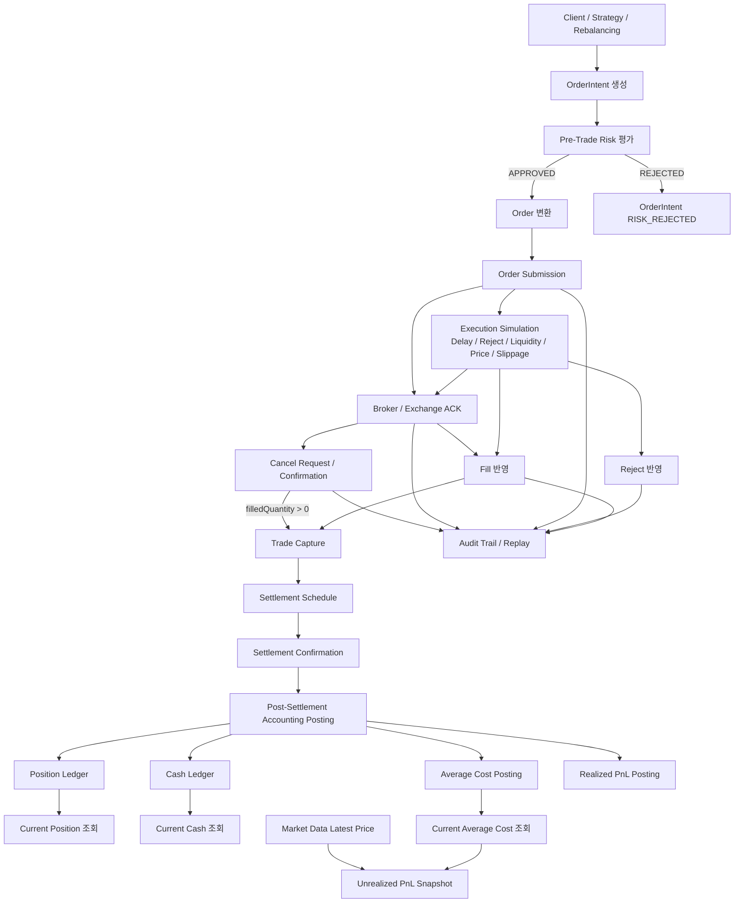
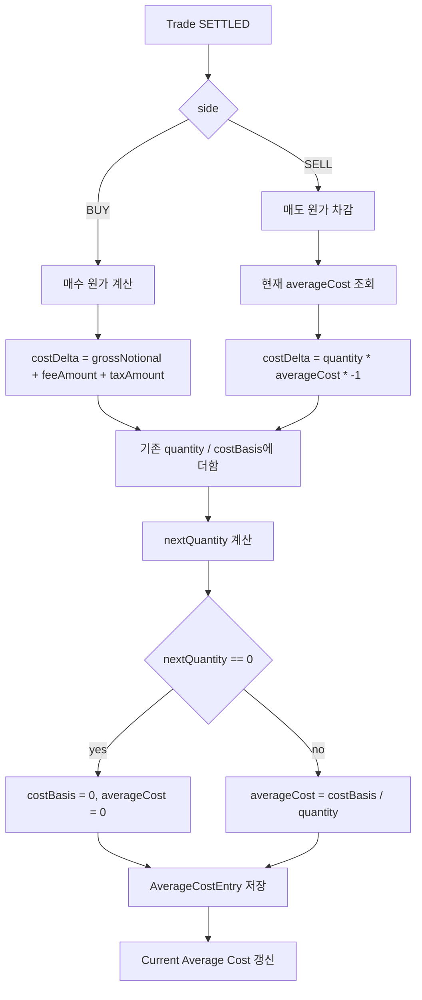
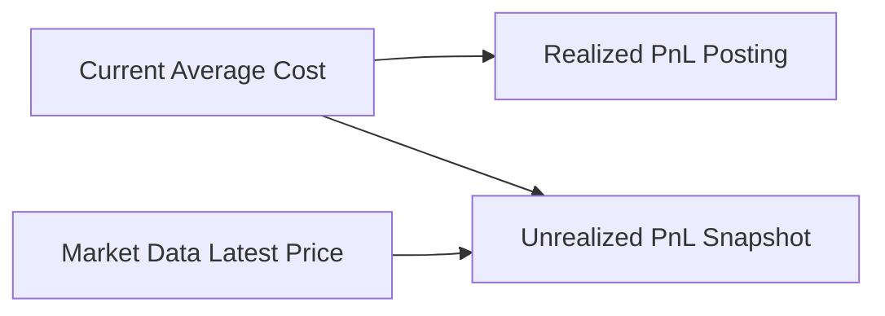

# Order Lifecycle Flow

이 문서는 MVP 주문 흐름을 한눈에 보기 위한 전체 동작 플로우다.

개별 API 계약은 각 모듈 문서에 두고, 여러 모듈을 가로지르는 흐름은 이 문서에서 관리한다.

## 전체 MVP 흐름

## 단계별 책임

| Step | Module | 책임 |
| --- | --- | --- |
| OrderIntent 생성 | `intent-generation` | 수동/리밸런싱/전략 주문 의도를 공통 모델로 생성 |
| Pre-Trade Risk 평가 | `pre-trade-risk` | 주문 전 한도, 중복 주문, 가격 밴드, kill switch 검사 |
| Order 변환/실행 | `execution` | risk 승인 intent를 실제 order로 변환하고 ACK/FILL/CANCEL/REJECT 상태 관리 |
| Execution Simulation | `execution` | broker/exchange reject 확률, 체결 가능 수량, latest price 기준 지정가 체결 조건, 시장가 슬리피지, 20~200ms 지연 반영 |
| Trade Capture | `post-trade` | execution fill 결과를 post-trade trade로 캡처 |
| Settlement | `post-trade` | trade 결제 예정/완료 상태 관리 |
| Accounting Posting | `post-trade` | settled trade를 position/cash ledger, average cost, realized PnL 회계 흐름에 반영 |
| Average Cost Posting | `post-trade` | settled trade를 평균단가 원장에 반영 |
| PnL | `post-trade` | realized/unrealized PnL 계산 |
| Market Data | `market-data` | latest price 저장/조회 |
| Audit Replay | `audit-replay` | execution/fill event 기반 감사 추적과 replay 검증 |

## Average Cost 흐름

평균단가는 post-trade에서 settled trade를 기준으로 별도 원장에 반영한다.

## 현재 평균단가 정책

| Trade | 처리 |
| --- | --- |
| `SETTLED` BUY | `grossNotional + feeAmount + taxAmount`를 cost basis에 더한다. |
| `SETTLED` SELL | 현재 average cost 기준으로 매도 수량만큼 cost basis를 줄인다. |
| 전량 매도 | quantity, costBasis, averageCost를 모두 0으로 초기화한다. |
| 보유 수량보다 큰 SELL | MVP에서는 short position을 지원하지 않으므로 거절한다. |
| 이미 posting된 trade | 기존 `AverageCostEntry`를 반환한다. |

## PnL 연결

PnL API는 수동 입력 경계와 서버 내부 조회 경계를 함께 제공한다.

현재 연결 방향:

- post-settlement accounting posting
  - 운영형 API: settlement 완료 trade를 position/cash ledger, average cost, SELL realized PnL에 한 번에 반영
  - 개별 posting API: 테스트/시뮬레이션과 장애 복구 경계로 유지
- realized PnL posting
  - 시뮬레이션 API: request body의 `averageCost` 사용
  - 운영형 API: `AverageCostService.averageCostForRealizedPnl()` 조회값 사용
- unrealized PnL latest snapshot
  - 시뮬레이션 API: query parameter의 `averageCost`와 market-data latest price 사용
  - 운영형 API: average cost와 market-data latest price를 모두 서버 내부에서 조회

## 문서 위치 기준

문서는 아래 기준으로 나눈다.

| 문서 | 용도 |
| --- | --- |
| `docs/order-lifecycle-flow.md` | 여러 모듈을 가로지르는 전체 흐름과 도식 |
| `docs/order-intent-api.md` | 주문 의도 생성/조회 API 계약 |
| `docs/pre-trade-risk-api.md` | 사전 리스크 평가 API 계약 |
| `docs/execution-api.md` | 주문 변환, 제출, ACK/FILL/CANCEL/REJECT API 계약 |
| `docs/post-trade-api.md` | trade capture, settlement, ledger, average cost, PnL API 계약 |
| `docs/restful-api-strategy.md` | REST API 설계 원칙과 endpoint 목록 |
| `HISTORY.md` | slice별 작업 이력과 결정 이유 |
